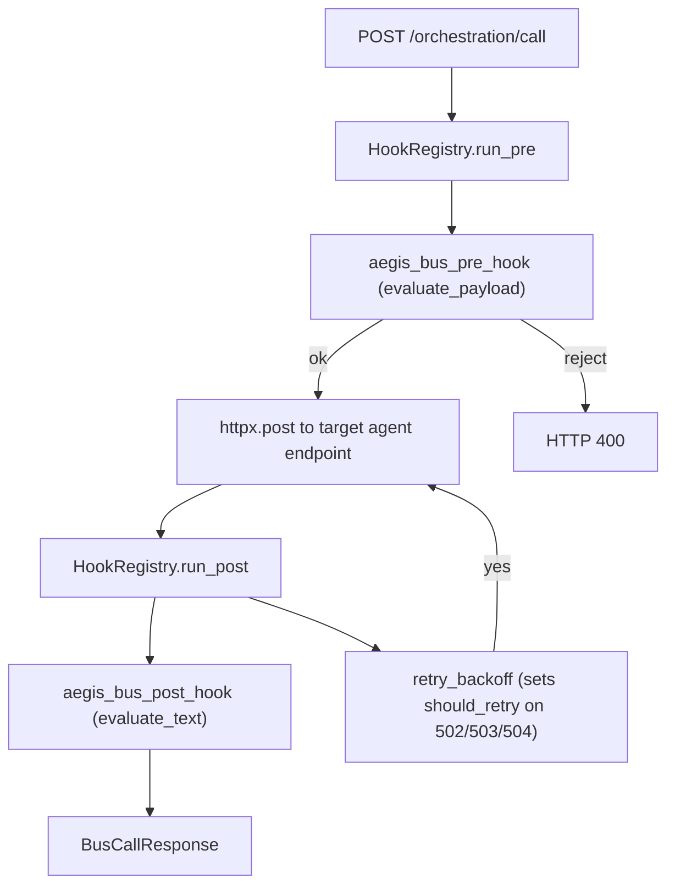

# Agent Runtime Spec

Lightweight Python orchestration runtime that loads YAML agent manifests and routes work through Zeus Core. Ground truth: [zeus/orchestration/runtime.py](../orchestration/runtime.py), [zeus/orchestration/bus.py](../orchestration/bus.py), [zeus/orchestration/hooks.py](../orchestration/hooks.py), [zeus/orchestration/daemon.py](../orchestration/daemon.py).

## Scope

In scope:

- Agent definition loading from `zeus/orchestration/agents/*.yaml`
- Agent lifecycle (`start`, `stop`, `status`, `list`)
- Inter-agent routing via the FastAPI bus
- Pre and post hooks (Aegis validation, retry-with-backoff, bus metrics, context-key validation)
- Task runner for multi-step agent tasks
- Kairos background daemon (observe, decide, act, update)

Out of scope:

- Distributed consensus, multi-node swarm federation
- External plugin marketplace

## Modules

| File | Role |
|------|------|
| `zeus/orchestration/runtime.py` | Manifest load, `AgentRuntime` lifecycle, `AgentStep` + `StepResult` + `TaskRecord`, `TaskRunner` |
| `zeus/orchestration/bus.py` | `/orchestration/*` FastAPI router (status, agents, call, tasks, kairos/status) |
| `zeus/orchestration/hooks.py` | `HookRegistry`, `BusMetrics`, built-in pre (`validate_context`, `log`) and post (`log`, `retry_backoff`, `bus_metrics`) hooks |
| `zeus/orchestration/daemon.py` | `KairosAgent`, `KairosDaemon`, `MemoryDriftObserver`, `KairosState` |
| `zeus/safety/integration.py` | `aegis_bus_pre_hook` + `aegis_bus_post_hook` registrations |

## Data model

`AgentDefinition` (from YAML):

- `name: str`
- `description: str`
- `model: dict[str, str]`
- `tools: list[str]`
- `context: list[str]`
- `safety.policy: str` (matches a file in `zeus/safety/policies/`)
- `config: dict[str, Any]`

`AgentStep`:

- `name: str`
- `tool: str`
- `inputs: dict[str, Any]`
- `on_failure: "skip" | "retry" | "abort"` (default `abort`)

`StepResult`:

- `step: str`, `status: "ok" | "skipped" | "failed"`, `output: Any`, `error: str | None`, `elapsed_ms: int`

`TaskRecord`:

- `id: str`, `agent: str`, `status: TaskStatus`, `steps: list[StepResult]`, `started_at`, `finished_at`

`BusCallRequest` / `BusCallResponse`:

- Request: `target_agent`, `endpoint`, `method`, `payload`, `correlation_id`, `idempotent`
- Response: `agent`, `endpoint`, `status`, `data`, `error`, `correlation_id`

## Request lifecycle

The pre-hook chain is: `validate_context` (enforces required keys in dev, warns in prod), `log`, `aegis_input_validator`. The post-hook chain is: `log`, `retry_backoff`, `bus_metrics`, `aegis_output_filter`.

## FastAPI surface

| Method | Path | Purpose |
|--------|------|---------|
| GET | `/orchestration/status` | Runtime health + agent states |
| GET | `/orchestration/agents` | List loaded agent manifests |
| POST | `/orchestration/agents/{name}/action` | `{"action": "start" \| "stop"}` |
| POST | `/orchestration/call` | `BusCallRequest` to a named agent's endpoint |
| POST | `/orchestration/tasks` | Create a multi-step task from `task_description` or explicit `steps` |
| GET | `/orchestration/tasks` | List recent `TaskRecord`s (ring buffer) |
| GET | `/orchestration/tasks/{task_id}` | Poll a single task |
| GET | `/orchestration/kairos/status` | Daemon state snapshot |

## Task runner

`TaskRunner.run(agent, steps)` iterates each `AgentStep`, dispatches via the bus, collects `StepResult`. Retries individual steps when `on_failure=retry`; aborts the task when `on_failure=abort`. Bus-level retries are handled separately by `retry_backoff` (max 3, exponential backoff).

## Kairos daemon

`zeus/orchestration/daemon.py` runs an async observe, decide, act, update loop:

1. `observe()` sums signals from registered `ObservationSource`s (default: `MemoryDriftObserver`).
2. `decide(observation)` calls an LLM to return a `CognitivePlan(steps: list[ToolCall])`.
3. `act(plan)` iterates tool calls, each one routed through `aegis_bus_pre_hook(policy="standard")` before dispatch. Only tools in `ZEUS_KAIROS_TOOL_ALLOWLIST` (default `zeus_memory_search`) are eligible.
4. `update_memory(result)` writes a summary into the `execution_log` namespace via `zeus_remember`.

Env-gated: `ZEUS_KAIROS_ENABLED`, `KAIROS_INTERVAL_MINUTES` (default 60), `KAIROS_MAX_ACTIONS_PER_CYCLE` (default 5).

## Error handling

- Pre-hook rejections raise HTTP 400 with policy reason in the detail.
- Unknown agents return 404.
- Invalid envelopes return 422.
- All responses include the `correlation_id` the client sent or a generated UUID.

## Observability

Runtime surfaces via `BusMetrics` (calls, errors, latency) and the `/admin` endpoints:

- Per-agent request count and average latency
- Per-hook rejection counts
- Bus dispatch failures
- Kairos cycle count and last action summary

## Acceptance criteria

- Runtime loads all YAML definitions without errors.
- `/orchestration/agents` returns all configured olympians.
- `/orchestration/call` succeeds for valid routes and rejects invalid policy or tool usage.
- Logs include `correlation_id` for every orchestration event.
- Aegis pre-hook blocks prompt-injection patterns before they leave the bus.
