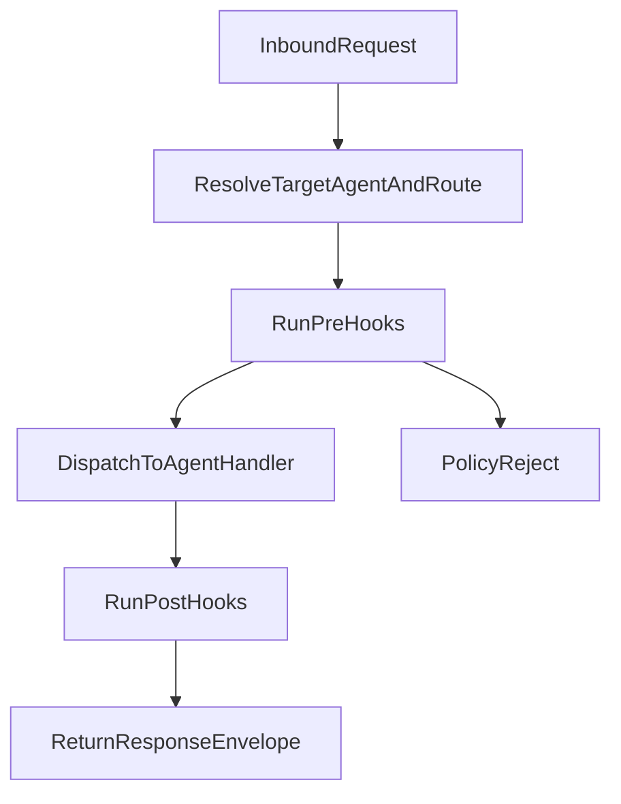

# Zeus Agent Runtime Spec

## Purpose

Define a lightweight Python orchestration runtime for Zeus that executes existing YAML agent definitions and routes work through Zeus Core.

## Scope

In scope:
- Agent definition loading from `zeus/orchestration/agents/*.yaml`
- Agent lifecycle (`start`, `stop`, `status`, `list`)
- Inter-agent routing via FastAPI bus
- Before/after policy hooks inspired by Squad's hook pipeline
- Basic event bus for asynchronous notifications

Out of scope:
- Distributed consensus and multi-node swarm federation
- Complex scheduling and worker pools
- External plugin marketplace

## Runtime Modules

- `zeus/orchestration/runtime.py`: runtime bootstrap + lifecycle manager
- `zeus/orchestration/bus.py`: request routing and envelope handling
- `zeus/orchestration/hooks.py`: pre/post execution hook processing
- `zeus/orchestration/registry.py`: agent manifest cache and validation
- `zeus/orchestration/events.py`: in-process pub/sub event bus

## Data Model

### AgentDefinition

- `name: str`
- `description: str`
- `model: dict[str, str]`
- `tools: list[str]`
- `context: list[str]`
- `safety.policy: str`
- `config: dict[str, Any]`

### RuntimeAgentState

- `name: str`
- `status: str` (`stopped|starting|running|degraded|failed`)
- `started_at: datetime | None`
- `last_error: str | None`
- `request_count: int`
- `avg_latency_ms: float`

### BusEnvelope

- `request_id: str`
- `source_agent: str`
- `target_agent: str`
- `route: str`
- `payload: dict[str, Any]`
- `context: dict[str, Any]`
- `timestamp: datetime`

## Request Lifecycle

## Hook Pipeline

Hooks are ordered and short-circuit on rejection.

### Pre hooks

1. Route validation
2. Safety policy selection
3. Tool allowlist enforcement
4. Payload schema checks

### Post hooks

1. Output safety filtering
2. Metadata enrichment
3. Metrics/log emission

## API Surface (Zeus Core)

- `GET /orchestration/status`
- `GET /orchestration/agents`
- `POST /orchestration/agents/{name}/start`
- `POST /orchestration/agents/{name}/stop`
- `POST /orchestration/dispatch`

## Error Handling

- All runtime and bus errors return structured JSON:
  - `error.code`
  - `error.message`
  - `error.request_id`
- Failed pre-hooks return `403` with policy reason
- Unknown agents return `404`
- Invalid envelopes return `422`

## Observability

Runtime should emit:
- per-agent request count
- per-agent latency distribution
- hook rejection count by policy
- bus dispatch failures

## Milestones

1. Parse and validate agent YAMLs at startup
2. Implement lifecycle and status endpoints
3. Implement dispatch endpoint with bus envelope
4. Implement pre/post hook pipeline
5. Add metrics and structured logs

## Acceptance Criteria

- Runtime loads all YAML definitions without errors
- `/orchestration/agents` returns all configured olympians
- Dispatch succeeds for valid routes and rejects invalid policy/tool usage
- Logs include `request_id` for all orchestration events
