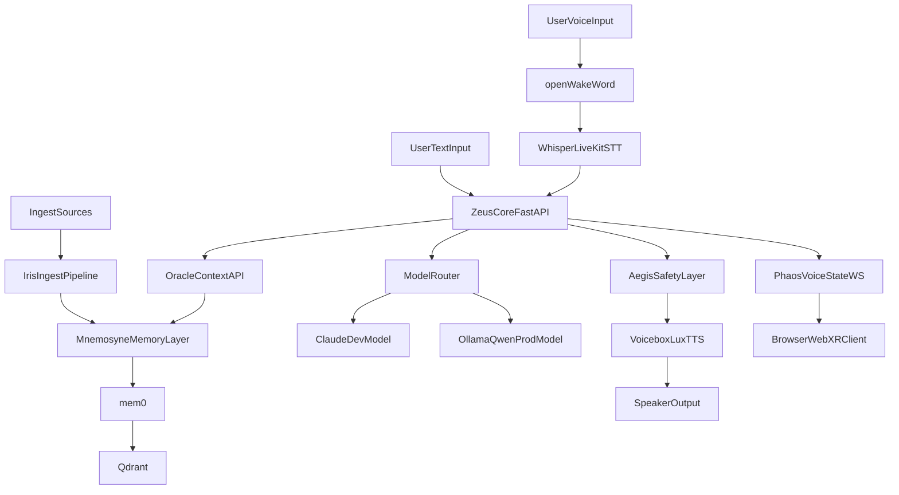
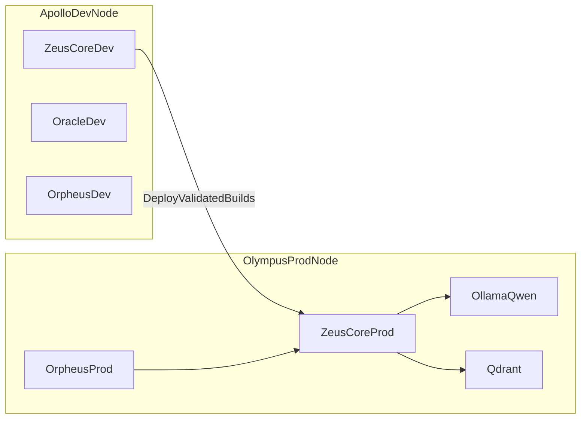
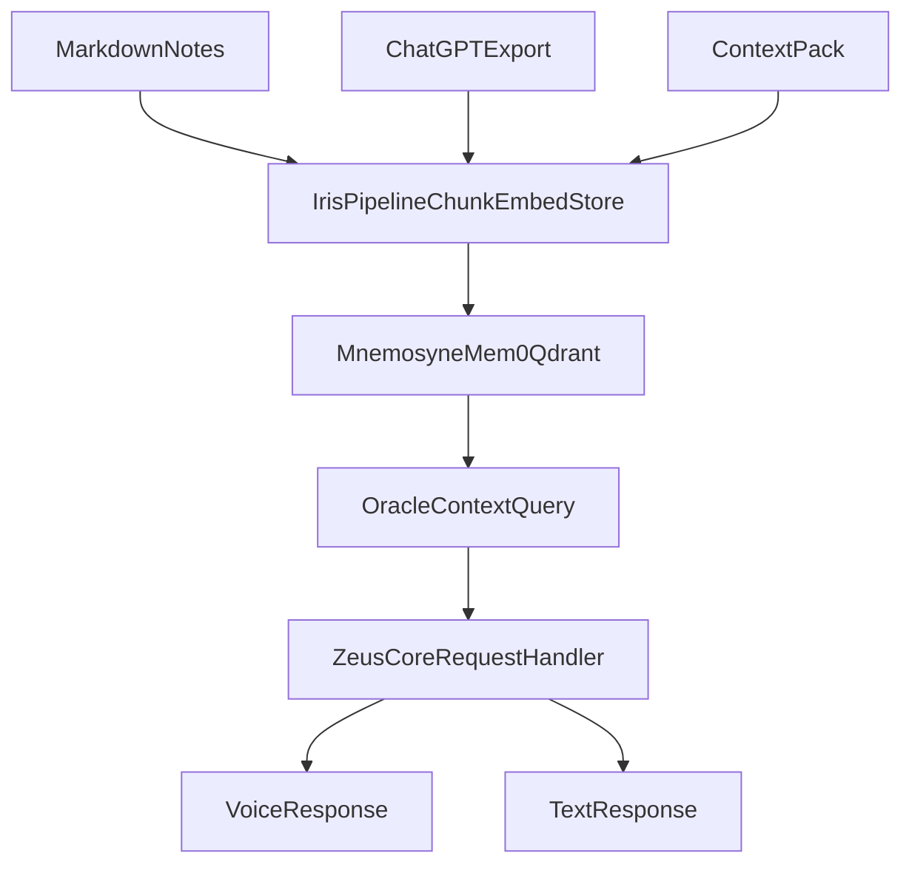

# Zeus Architecture

This is the consolidated architecture reference for Zeus.

## System Layers

## Runtime Components

- `zeus-core`: primary FastAPI service entrypoint and status routes
- `oracle`: context shaping API for memory retrieval
- `mnemosyne`: memory abstraction over mem0 + Qdrant
- `iris`: source ingestion and chunk persistence pipeline
- `orpheus`: voice interaction loop (wake -> STT -> LLM -> TTS)
- `phaos`: voice-state visualization (WebSocket from Core, Three.js / WebXR in browser; Orpheus publishes state via HTTP when not colocated)
- `aegis`: policy and safety filtering layer

## Deployment Topology

## Data Flow

## Environment Split

| Area | Dev (`ZEUS_ENV=dev`) | Prod (`ZEUS_ENV=prod`) |
|---|---|---|
| LLM | Claude API | Ollama Qwen2.5-7B Q4_K_M |
| Logging | Debug-friendly | Structured + lower verbosity |
| Hardware | Apollo (RTX 5080) | Olympus (RTX 3080) |
| Primary target | Fast iteration | Stable daily assistant |

## External personal data (parallel integrations)

Zeus ingests **local files** under `zeus/data/raw/` and can later call **local HTTP APIs** for live status. Documented integrations:

- **[Obsidian Self-hosted LiveSync](obsidian-livesync-ingest.md)** — CouchDB ↔ local vault (Obsidian or official CLI) ↔ symlink under `zeus/data/raw/notes/` ↔ scheduled Iris markdown ingest.
- **[Project N.O.M.A.D.](project-nomad-integration.md)** — Command Center at `/home/chris/apps/project-nomad`; hybrid of future live API calls and Iris ingest for catalogs/metadata (separate from NOMAD’s own Ollama/Qdrant stack).

## Immediate Architectural Priorities

1. Complete Sprint 1-4 baseline path (memory loop, voice, safety, deploy)
2. Implement orchestration runtime for agent YAMLs (Sprint 5)
3. Implement session continuity (Sprint 6)
4. Implement chat UI and MCP integration (Sprint 7-8); Phaos viz ships with chat early (see roadmap Sprint 7 notes)
5. Add observability and scheduled ingest (Sprint 9)

## Legacy Planning Sources

Legacy planning documents converted from `.docx` are available in:

- `zeus/zeus/docs/architecture_legacy_architecture.md`
- `zeus/zeus/docs/memory_ingest_legacy_memory_ingest.md`
- `zeus/zeus/docs/roadmap_legacy_roadmap.md`
