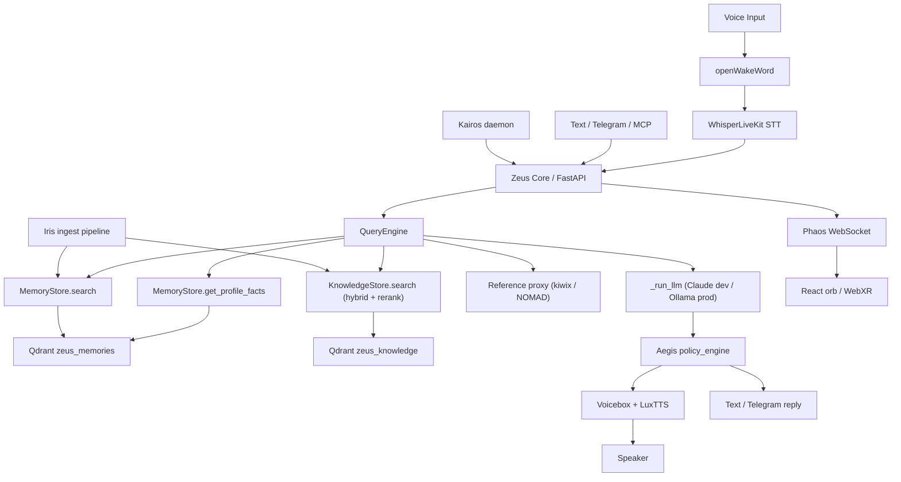
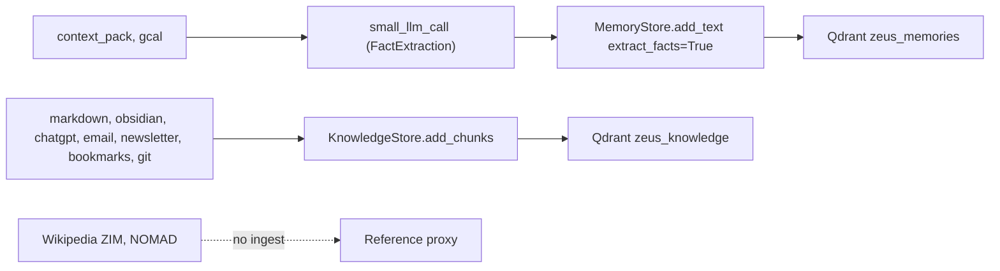
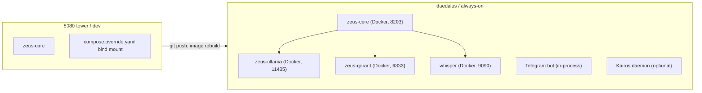

# Zeus Architecture

Subsystem-level reference for how Zeus is wired today. For the concise project brief and stack decisions, see [CLAUDE.md](../../CLAUDE.md). For the three-layer memory plan and migration runbook, see [docs/memory-architecture-plan.md](../../docs/memory-architecture-plan.md).

## System layers

## Runtime components

| Name | Code | Role |
|------|------|------|
| zeus-core | `zeus/core/main.py` | FastAPI entrypoint; mounts chat, admin, oracle, orchestration, newsletter, voice-state routers on port 8203 |
| Oracle API | `zeus/api/main.py` | `/context/query`, `/context/profile`, `/memory/search`, `/memory/add`, `/memory/{id}`, `/ingest/trigger` |
| QueryEngine | `zeus/core/query.py` | Retrieval fan-out + chat LLM (`_run_llm`) with 3-attempt reflection |
| MemoryStore | `zeus/memory/store.py` | `zeus_memories` collection; LLM fact extraction via `small_llm_call`; bi-temporal payloads |
| KnowledgeStore | `zeus/memory/library.py` | `zeus_knowledge` collection; dense + BM25 RRF hybrid; optional BGE-reranker |
| Reference | `zeus/memory/reference.py` | `KiwixClient`, `NomadClient`; live HTTP query at retrieval time |
| Small-LLM router | `zeus/core/small_llm.py` | `small_llm_call()` over the configured provider chain with privacy-tier gating |
| Iris ingest | `zeus/ingest/pipeline.py`, `run.py`, `config.py` | Walks sources, routes per-chunk to memory or knowledge per `zeus/ingest/config.yaml` |
| Sessions | `zeus/core/sessions.py` | `SessionManager` + `InMemoryStorage` / `SQLiteSessionStorage` |
| Agent runtime | `zeus/orchestration/runtime.py`, `bus.py`, `hooks.py` | YAML lifecycle + `/orchestration/call` bus + Aegis pre/post hooks |
| Kairos daemon | `zeus/orchestration/daemon.py` | Observe, decide, act, update loop; read-only tool allowlist by default |
| Orpheus | `zeus/voice/*.py` | Host-native voice loop (wake, STT, chat LLM stream, TTS, playback) |
| Phaos | `zeus/core/voice_ws.py`, `zeus/voice/state.py` | WebSocket voice-state + HTTP publish |
| MCP server | `zeus/mcp/server.py`, `tools.py` | FastMCP over Zeus Core HTTP: `zeus_query`, `zeus_profile`, `zeus_remember`, `zeus_memory_search`, `zeus_ingest_trigger` |
| Telegram bot | `zeus/integrations/telegram/bot.py` | Allowed-chat gate, Aegis filter, plain-text replies |
| Benchmarks | `zeus/bench/` | Per-model tok/s + TTFT + prompt-eval; persisted to `zeus/data/benchmarks.json` |
| Admin | `zeus/core/admin.py` | Metrics, ingest stats, runtime settings, model switch |

## Retrieval fan-out

`QueryEngine._collect_retrieval_context()` runs profile, memory, knowledge, and reference lookups in parallel via `asyncio.gather`. Each result populates a labelled block in the rendered system prompt. Sub-budgets under `ZEUS_CONTEXT_MAX_TOKENS` (default 6144):

| Block | Share | Source |
|-------|------:|--------|
| Profile | 20% | `get_profile_facts()` over MemoryStore (identity / preference facts) |
| Memories | 25% | `search_memories()` top-k on MemoryStore |
| Knowledge | 45% | `search_knowledge()` top-k on KnowledgeStore (hybrid + optional rerank) |
| Reference | 10% | `search_reference()` async over kiwix / NOMAD when enabled |

The remaining 2/3 of the budget goes to the session block (rolling summary plus newest turns packed newest-first).

## Writes: two collections, two shapes

Routing is declared in `zeus/ingest/config.yaml` under each source's `target`. Bulk sources skip the LLM write path entirely; curated sources go through `small_llm_call(response_format=FactExtraction, min_privacy_tier=1)`.

## Two LLM layers

| Layer | Entry point | Purpose | Provider selection |
|-------|-------------|---------|--------------------|
| Chat / "big personal stuff" | `_run_llm()` in `zeus/core/query.py` | Grounded chat, voice, Telegram replies | `ZEUS_ENV` + `ZEUS_LLM`: Claude Sonnet in dev, Ollama Qwen in prod |
| Batch / structured output | `small_llm_call()` in `zeus/core/small_llm.py` | Fact extraction, newsletter summaries, titles, classifiers, future Kairos decide step | `ZEUS_SMALL_LLM_CHAIN` with privacy-tier gate and daily USD cap |

LiteLLM is explicitly forbidden (March 2026 supply-chain attack on versions 1.82.7/1.82.8). Gemini free tier is excluded from the default chain because it trains on input.

## Safety model

Aegis is two layers that do not overlap:

- **In-process policy engine.** `zeus/safety/policy_engine.py` loads a YAML policy from `zeus/safety/policies/` and exposes `evaluate_text()` (for output) and `evaluate_payload()` (for tool arguments). Enabled by `ZEUS_AEGIS_ENABLED=1`; policy name from `ZEUS_AEGIS_POLICY` or `NEMOCLAW_POLICY`. Registered as pre and post hooks on the orchestration bus in `zeus/safety/integration.py`.
- **Host-level sandbox (optional).** NemoClaw + OpenShell on daedalus. Runbook: [docs/nemoclaw-ops.md](../../docs/nemoclaw-ops.md). Zeus Core still applies in-process Aegis when the sandbox is bypassed or absent.

## Deployment topology

`compose.override.yaml` bind-mounts `./zeus` read-only into `zeus-core` during development, so pure-Python edits take effect with a container restart (or none at all for `docker exec` scripts). Olympus / production uses the baked image only.

## Environment split

| Area | Dev (`ZEUS_ENV=dev`) | Prod (`ZEUS_ENV=prod`) |
|------|----------------------|------------------------|
| Chat LLM | Claude Sonnet 4.6 via Anthropic API | Ollama `qwen2.5:7b-instruct` |
| Small-LLM chain | Full chain (Gemini paid, Groq, OpenRouter, Haiku, Ollama) | Same; Ollama fallback guaranteed |
| Logging | Debug-friendly | Structured, lower verbosity |
| Hardware | 5080 tower or daedalus dev | daedalus (RTX 3080) for now; Olympus target |

## External personal data

Zeus ingests local files under `zeus/data/raw/` and can call local HTTP APIs for live status. Documented integrations:

- [Obsidian Self-hosted LiveSync](obsidian-livesync-ingest.md): CouchDB to local vault to symlink under `zeus/data/raw/notes/` to scheduled markdown ingest.
- [Project N.O.M.A.D.](project-nomad-integration.md): live reference-layer proxy plus optional metadata ingest.

## Related docs

- [agent-runtime-spec.md](agent-runtime-spec.md): lifecycle, bus envelopes, hook pipeline
- [sessions-spec.md](sessions-spec.md): session model, packing, summarization
- [chat-interface-spec.md](chat-interface-spec.md): HTTP surface used by chat, Telegram, MCP
- [mcp-server-spec.md](mcp-server-spec.md): MCP tool catalog
- [orpheus-spec.md](orpheus-spec.md): voice pipeline details
- [phaos-voice-state-protocol.md](phaos-voice-state-protocol.md): voice-state WS protocol
- [ingest-guide.md](ingest-guide.md) and [ingest-paths.md](ingest-paths.md): source ordering, paths, schedules
- [deployment.md](deployment.md): Olympus deployment runbook
- [model-comparison.md](model-comparison.md): measured per-model tok/s and VRAM fit
- [roadmap.md](roadmap.md): sprint plan and open work
