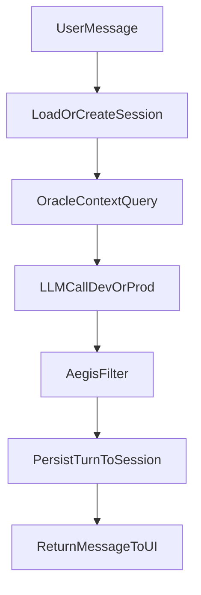

# Zeus Chat Interface Spec

## Goal

Provide a minimal local web chat interface for Zeus that shares the same context + LLM logic as voice mode and supports sessions.

## User Stories

- As Chris, I can open a local URL and chat with Zeus without voice input.
- As Chris, I can continue the same session across multiple messages.
- As Chris, I can see streaming responses with low perceived latency.

## Routes

- `GET /chat` -> serves `chat.html`
- `GET /viz` -> standalone Phaos (voice-state orb) page; links to chat
- `POST /chat/message` -> JSON chat API (non-streaming)
- `POST /chat/stream` -> SSE streaming (`text/event-stream`; events: `token`, `done`, `phase`, `error`)
- `GET /chat/sessions` -> list recent sessions (query `limit`)
- `GET /chat/sessions/{session_id}` -> full session (turns, `topic`, …)
- `DELETE /chat/sessions/{session_id}` -> delete session

Static assets (Three.js import maps, `phaos.js`, `orb.js`, `chat-markdown.js`, …) are served from `GET /static/...` via FastAPI `StaticFiles` on `zeus/core/static/`.

**UI roadmap:** [chat-ui-improvements.md](chat-ui-improvements.md) (markdown, copy, abort, token estimate, drafts, tabs, themes).

## Request / Response Models

### ChatMessageRequest

- `session_id: str | None`
- `message: str`
- `max_tokens: int | None`
- `use_context: bool = true`

### ChatMessageResponse

- `session_id: str`
- `assistant_message: str`
- `context_sources: list[str]`
- `latency_ms: int`
- `model_used: str`
- `token_estimate: int` (heuristic ~`len/4`)
- `topic: str | None` (session label from first user message)

### Chat session summary (list item)

- `id`, `created_at`, `updated_at`, `turn_count`, `summary`, `topic`, `metadata`

### SSE `done` event (streaming)

- `session_id`, `latency_ms`, `model_used`, `topic`, `token_estimate`

## Processing Flow

## UI Requirements

- Single-page HTML/JS (no framework required for v1)
- Dark mode default
- Scrollable transcript
- Input box + send button + enter-to-send
- Session ID badge and "new session" action
- Basic error toast for failed requests
- **Phaos:** embedded voice-state visualization (Three.js orb) that subscribes to `WS /ws/voice-state`; optional WebXR VR entry button; mic level via Web Audio during `listening` (see [`phaos-voice-state-protocol.md`](phaos-voice-state-protocol.md))

## Non-Functional Targets

- Time-to-first-token <= 1000ms in dev
- Full response <= 6s for typical prompts
- Graceful failure if Oracle is unavailable (fallback without context)

## Security and Privacy

- Chat is local-only by default (`localhost` binding)
- No third-party analytics
- Redact secrets in logs where possible
- All output passes through Aegis before returning

## Logging

For each message:
- `request_id`
- `session_id`
- `prompt_hash`
- `context_source_count`
- `latency_ms`
- `token_estimate`

## Implementation Notes

- Place routes in `zeus/core/chat.py`
- Serve static UI from `zeus/core/static/chat.html` and Phaos from `zeus/core/static/viz/`
- Voice-state WebSocket and publish endpoint live in `zeus/core/voice_ws.py`; hub types in `zeus/voice/state.py`
- Reuse existing model routing from core/voice path where possible (`ZEUS_LLM`, `ZEUS_ENV`, Ollama vs Claude)
- Integrate with session module from `sessions-spec.md` (in-memory sessions are a temporary stand-in until Sprint 6)

## Acceptance Criteria

- `/chat` page loads and sends messages successfully
- Session continuity works across at least 3 turns
- Context sources are attached in API response
- Aegis filtering is applied before final output
