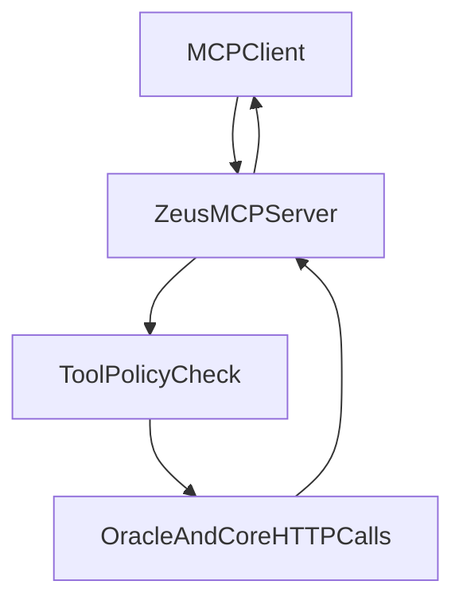

# Zeus MCP Server Spec

## Goal

Expose Zeus capabilities as MCP tools so external assistants (Cursor, Claude clients, other MCP consumers) can query and write Zeus memory safely.

## Runtime Shape

- Python MCP server process: `python -m zeus.mcp.server`
- Calls Zeus Core / Oracle HTTP endpoints internally
- Optional direct memory write path for trusted tools only

## Tool Catalog (v1)

### `zeus_query`

Natural language context lookup.

**Input**
- `query: string`
- `top_k: integer` (default `5`)
- `max_tokens: integer` (default `1024`)

**Output**
- `context: string`
- `sources: string[]`
- `token_estimate: integer`

### `zeus_profile`

Return stable user profile summary.

**Input**
- none

**Output**
- `profile: string`
- `updated_at: string`

### `zeus_remember`

Store new memory text with metadata.

**Input**
- `text: string`
- `namespace: string` (default `general`)
- `tags: string[]` (optional)

**Output**
- `memory_id: string`
- `status: string`

## Request Path

## Security Policy

- Tool allowlist by client identity
- `zeus_remember` disabled by default for unknown clients
- Input validation on all tool arguments
- Output filtered by Aegis policy before returning

## Config

Environment:
- `ZEUS_CORE_URL` (default `http://localhost:8000`)
- `ZEUS_MCP_BIND_HOST` (default `127.0.0.1`)
- `ZEUS_MCP_BIND_PORT` (optional transport-dependent)
- `ZEUS_MCP_ALLOW_WRITE` (`false` by default)

## Error Contract

Tool failures return MCP errors with:
- `code`
- `message`
- `details.request_id`

## Compatibility Targets

- Cursor MCP client config
- Claude Desktop MCP config
- CLI-driven MCP invocation for local scripts

## Acceptance Criteria

- Client can call `zeus_query` and receive context
- Client can call `zeus_profile` and receive profile summary
- `zeus_remember` obeys write policy toggle and logs writes
- Invalid arguments return useful structured errors
