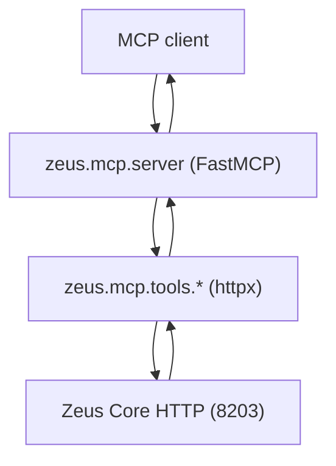

# Zeus MCP Server

Expose Zeus memory, knowledge, and ingest trigger as MCP tools so external assistants (Cursor, Claude Desktop, any MCP client) can query and write through the same HTTP surface that Core uses internally.

Ground truth: [zeus/mcp/server.py](../mcp/server.py), [zeus/mcp/tools.py](../mcp/tools.py).

## Runtime shape

- Python MCP server process: `python -m zeus.mcp.server`
- FastMCP transport. Tool handlers are thin wrappers over Zeus Core HTTP (`ZEUS_CORE_URL`, default `http://127.0.0.1:8203`).
- Write tools are gated by `ZEUS_MCP_ALLOW_WRITE=true`.

## Tool catalog

| Tool | Proxies | Purpose |
|------|---------|---------|
| `zeus_query` | `POST /context/query` | Grounded context lookup: runs QueryEngine retrieval fan-out and returns the rendered context block plus sources |
| `zeus_profile` | `GET /context/profile` | Stable user profile summary from MemoryStore identity / preference facts |
| `zeus_memory_search` | `POST /memory/search` | Raw MemoryStore search, top-k hits with scores |
| `zeus_remember` | `POST /memory/add` | Writes a new memory (requires `ZEUS_MCP_ALLOW_WRITE=true`) |
| `zeus_ingest_trigger` | `POST /ingest/trigger` | Kick off an ingest run for a named source |

### `zeus_query`

Input: `query: str`, `top_k: int = 8`, `max_tokens: int = 1024`
Output: `{"context": str, "sources": [str], "token_estimate": int}`

### `zeus_profile`

Input: none
Output: `{"profile": str, "updated_at": str}`

### `zeus_memory_search`

Input: `query: str`, `limit: int = 5`
Output: `{"results": [{"text": str, "score": float, "payload": {...}}]}`

### `zeus_remember`

Input: `text: str`, `namespace: str = "general"`, `tags: list[str] | None`
Output: `{"memory_id": str, "status": str}`

### `zeus_ingest_trigger`

Input: `source: str = "all"`
Output: `{"source": str, "status": str}`

## Request path



Aegis runs inside Zeus Core on every HTTP hop (pre-hook validates tool arguments, post-hook filters output). The MCP server itself does no extra filtering beyond what Core already enforces.

## Security

- Tool writes are off by default; flip `ZEUS_MCP_ALLOW_WRITE=true` to enable `zeus_remember` and `zeus_ingest_trigger`.
- Transport: stdio by default (recommended for Cursor / Claude Desktop). Bind only over trusted sockets.
- `ZEUS_CORE_URL` should point at a local interface; do not expose Zeus Core without a separate auth layer (see LAB-150).
- Aegis policy on the server side is selected by `ZEUS_AEGIS_POLICY`.

## Config

| Env | Default | Purpose |
|-----|---------|---------|
| `ZEUS_CORE_URL` | `http://127.0.0.1:8203` | Zeus Core base URL |
| `ZEUS_MCP_ALLOW_WRITE` | `false` | Enable `zeus_remember` and `zeus_ingest_trigger` |

## Error contract

Tool failures return structured MCP errors with `code`, `message`, and `details.request_id` / `details.correlation_id` forwarded from Zeus Core.

## Client configuration

### Claude Desktop / Cursor (stdio)

```json
{
  "mcpServers": {
    "zeus": {
      "command": "python",
      "args": ["-m", "zeus.mcp.server"],
      "cwd": "/home/chris/zeus",
      "env": {
        "ZEUS_CORE_URL": "http://127.0.0.1:8203",
        "ZEUS_MCP_ALLOW_WRITE": "false"
      }
    }
  }
}
```

Adjust `cwd` to your Zeus checkout.

## Acceptance

- Client can call `zeus_query` and receive grounded context with sources.
- `zeus_profile` returns a non-empty profile summary.
- `zeus_remember` 403s when `ZEUS_MCP_ALLOW_WRITE=false`; 200s with a memory id when enabled.
- `zeus_ingest_trigger` kicks off the source and returns a status code.
- Invalid arguments return structured MCP errors.
