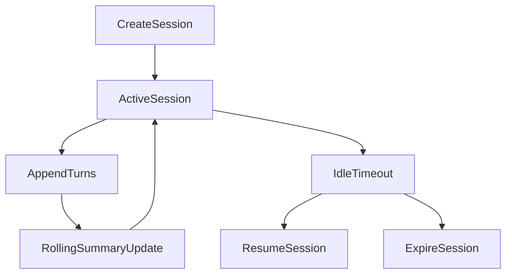

# Zeus Sessions Spec

## Goal

Introduce conversation sessions for continuity across chat and voice interactions.

## Session Model

### Session

- `session_id: str`
- `created_at: datetime`
- `updated_at: datetime`
- `mode: str` (`voice|chat|mixed`)
- `status: str` (`active|idle|closed|expired`)
- `summary: str | None`
- `metadata: dict[str, Any]`

### Turn

- `turn_id: str`
- `session_id: str`
- `role: str` (`user|assistant|system`)
- `content: str`
- `timestamp: datetime`
- `context_sources: list[str]`
- `token_estimate: int`

## Storage Strategy

Phase 1:
- SQLite sidecar for fast session operations
- Optional memory mirror for selected summary artifacts

Phase 2:
- Promote long-term session summaries into mnemosyne memory namespaces

## Lifecycle

## API Endpoints

- `POST /sessions` -> create session
- `GET /sessions/{session_id}` -> session metadata
- `GET /sessions/{session_id}/turns` -> transcript
- `POST /sessions/{session_id}/turns` -> append turn
- `POST /sessions/{session_id}/close` -> close session

## Context Injection Policy

When serving a response:

1. Include last N turns (default 8)
2. Include rolling summary if available
3. Include Oracle context retrieved for current user query
4. Respect token budget by truncating oldest turns first

## Summarization Policy

- Trigger summary every 6 turns or 1200 estimated tokens
- Keep summary concise and factual
- Preserve key decisions, preferences, active tasks
- Replace stale summaries with updated merged summary

## Retention

- Active session turns retained indefinitely by default
- Expired sessions can be archived after configurable TTL
- Sensitive sessions may be flagged for local-only no-export behavior

## Acceptance Criteria

- Sessions can be created and resumed
- Multi-turn continuity works in both chat and voice paths
- Rolling summary updates automatically
- Session data can be queried via API without errors
