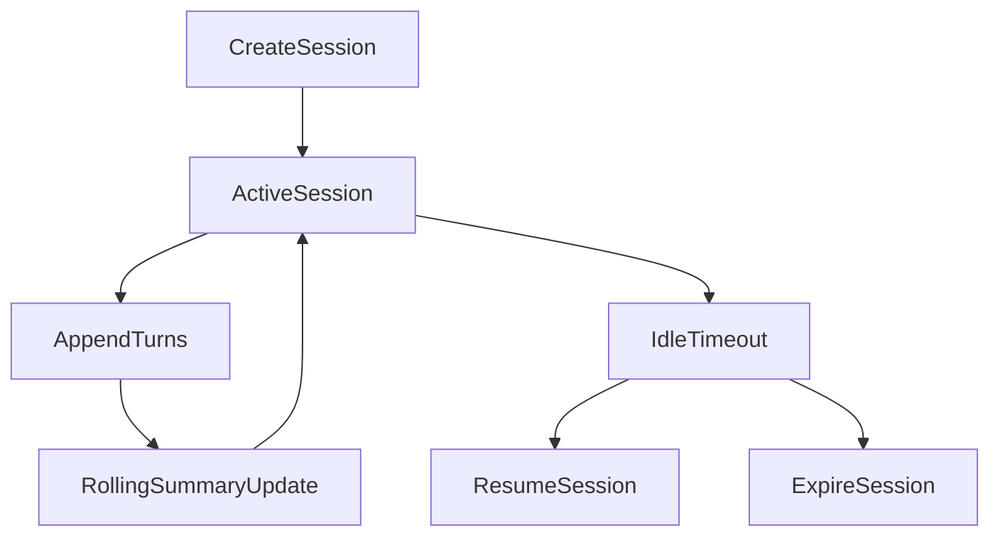

# Zeus Sessions Spec

## Goal

Introduce conversation sessions for continuity across chat and voice interactions.

## Session Model

### Session

- `session_id: str`
- `created_at: datetime`
- `updated_at: datetime`
- `mode: str` (`voice|chat|mixed`)
- `status: str` (`active|idle|closed|expired`)
- `summary: str | None`
- `metadata: dict[str, Any]`

### Turn

- `turn_id: str`
- `session_id: str`
- `role: str` (`user|assistant|system`)
- `content: str`
- `timestamp: datetime`
- `context_sources: list[str]`
- `token_estimate: int`

## Storage Strategy

Phase 1:
- SQLite sidecar for fast session operations
- Optional memory mirror for selected summary artifacts

Phase 2:
- Promote long-term session summaries into mnemosyne memory namespaces

## Lifecycle

## API Endpoints

- `POST /sessions` -> create session
- `GET /sessions/{session_id}` -> session metadata
- `GET /sessions/{session_id}/turns` -> transcript
- `POST /sessions/{session_id}/turns` -> append turn
- `POST /sessions/{session_id}/close` -> close session

## Context Injection Policy

When serving a response (implemented in `QueryEngine` + `SessionManager.get_context_window`):

1. **Budget:** `ZEUS_CONTEXT_MAX_TOKENS` (default 6144) is the single heuristic knob; **⅓** formats retrieved memory hits, **⅔** formats the session block.
2. **Recent turns:** Newest turns are packed into the session slice until the budget is exhausted (≈4 characters per token); candidates are limited to the newest `ZEUS_SESSION_PACK_MAX_TURNS` (default 150; `0` = no cap).
3. Include rolling summary if available (within the session slice’s summary sub-budget).
4. Include Oracle / MemoryStore retrieval for the current user query in the memory slice (not the session slice).
5. Oldest included turns drop first when the budget is full (greedy newest-first pack, then truncate).

## Summarization Policy

- **Trigger:** When stored turn count ≥ `ZEUS_SESSION_SUMMARY_AT_TURNS` (default 200; must exceed `ZEUS_SESSION_KEEP_RAW_TURNS`).
- **Compaction:** Summarize all but the last `ZEUS_SESSION_KEEP_RAW_TURNS` (default 150) full turns into the rolling summary, then retain only those raw turns.
- Keep summary concise and factual; preserve key decisions, preferences, active tasks.
- Merge new summary with any previous summary text.

## Retention

- Active session turns retained indefinitely by default
- Expired sessions can be archived after configurable TTL
- Sensitive sessions may be flagged for local-only no-export behavior

## Acceptance Criteria

- Sessions can be created and resumed
- Multi-turn continuity works in both chat and voice paths
- Rolling summary updates automatically
- Session data can be queried via API without errors
